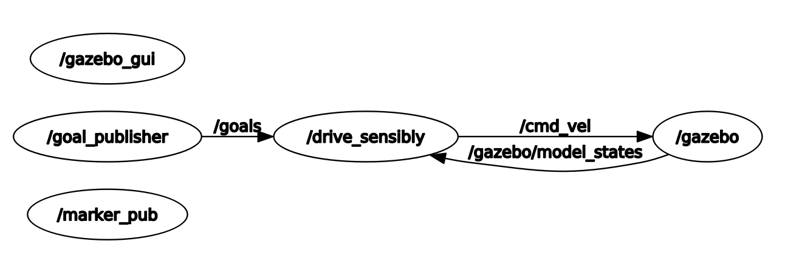

# Title
This repository is part of a Mini-project concerned to course of Advanced Software development for Autonomous Robots. It contains rospackages and other file for the problem decribed further.

When package is launched, the robot will navigate to as many different goal positions as possible that are published on a topic called /goals. The goals are not sorted, so it check the distance to all pending goals and then selects the closest one.
The robot is programmed to directly move towards goal in a straight line, meanwhile avoiding any obstacles in between.

# Getting Started
The rospackages cab be launched using following commands through terminal. (Although, you should probably be logged into a Linux system with ROS and Python installed).

```
    roslaunch sa_192128_miniproj drive_sensibly.launch
```
When the bot is unable to reach a goal position, it skips this target and moves towards next one.
This repository also contains the goal publisher package that provides input targets. target point can be modified in "config_final.yaml" file


# General Descrition of the project

Problem Statement: The robot is placed in an environment with many obtacles (such as cones, restaurants, walls etc). The target points are defined and robot has to cover all targets (one by one). It should avoid onstacles and print whenever it has reached set target.

The task is to create a package that, when launched, will navigate the turtlebot to as many different goal positions as possible that are published on a topic called /goals.
Following topics, services, actions have been employed (desciption of each is attached):

Rostopics used here: 

1. /scan : To subscribe and give output of Laser data
2. /gazebo/model_states: For current position of Robot
3. /goal_publisher: For publishing target points.
4. /cmd_vel: To publish velocity to robot

Rosservice used:

1. A service is created with custom service message of string data type. This can be used to manually cancel a target point. In that case the set_target function will be called and the next target point will be set.

```
rosservice call /cancel_server "data: 'pass'" 
```

## Node dependencies

 

# Abstract description and Implementation of the algorithm

The system initiates a node (/drive_sensibly). It subscribes to goal publisher that gives a message of type PointArray. It callbacks to a function that stores all this points inside a list (this command is excecuted only once). Then next step is to chose a target. Algorith calculates the Eucledian distance to all points and choses closest.

Node also subscribes to /gazebo/model_states that get the current position and orientation of robot. Orientation is in Quaternions format and thus converted to Euler angles.

Third is a cmd_vel publisher which creates a variable of 'Twist' message and thus linear and angular velocity can be given to robot.

Further is the Laser (/scan) topic. BTW the Laser scan creates a Python dictionary in which the data is stored. It is divided into 5 major parts (namely Front, Left, Right, Front Left and Front Right). A safe distance to obastaclce is set.
This divides our problem into two major state machines.

A. If there is no abstacle it should fix the orientation of robot and drive straight to that point. For this we calculate the error in yaw (obviously normalized one) and then rotate bot left or right based on simple 'if' statements. After orientation is aligned to a precision value then it starts to drive straight.

B. When there is any obstacle in front (checked by dictionary value of Laser scan), it rotates left or right (if there is more space on left, it will rotate left) and try to follow the obstacle until the front of robot is obstacle free.

Have a look at the State Machine graph for better understanding.

The robot checks its own displacement and orientation after every 10 seconds and compares it with threshold values given. If there is not enough movement it is probably stuck and tires to re-orient itself

Once all targets are achieved, it shuts down. It has done a lot of work and needs some rest.


# Problems / Checkpoints to be taken care of

1. Take care of range number of laser scan data. Eg: in my Gazebo simulation, Laser pointing in +X direction is range number zero. Laser pointing in +Y direction is range number 90. This means number are increasing in anticlockwise direction.
2. /gazebo/model_states published messages as a list with 3 elements. Ground plane, Turtle bot and other elements. Message is published as name,pose,twist. We can take pose[1]. This will give data about robot.
3. When switching states to wall follower, earlier I had coded to definitely rotate towards left- I think this was the reason robot was moving in a loop inside maze. I changed the condition > If there is more space on left, rotate left (if there is more space on right, rotate right).


