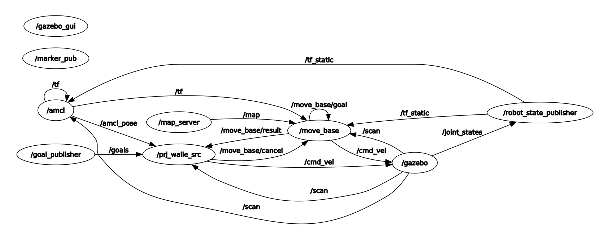
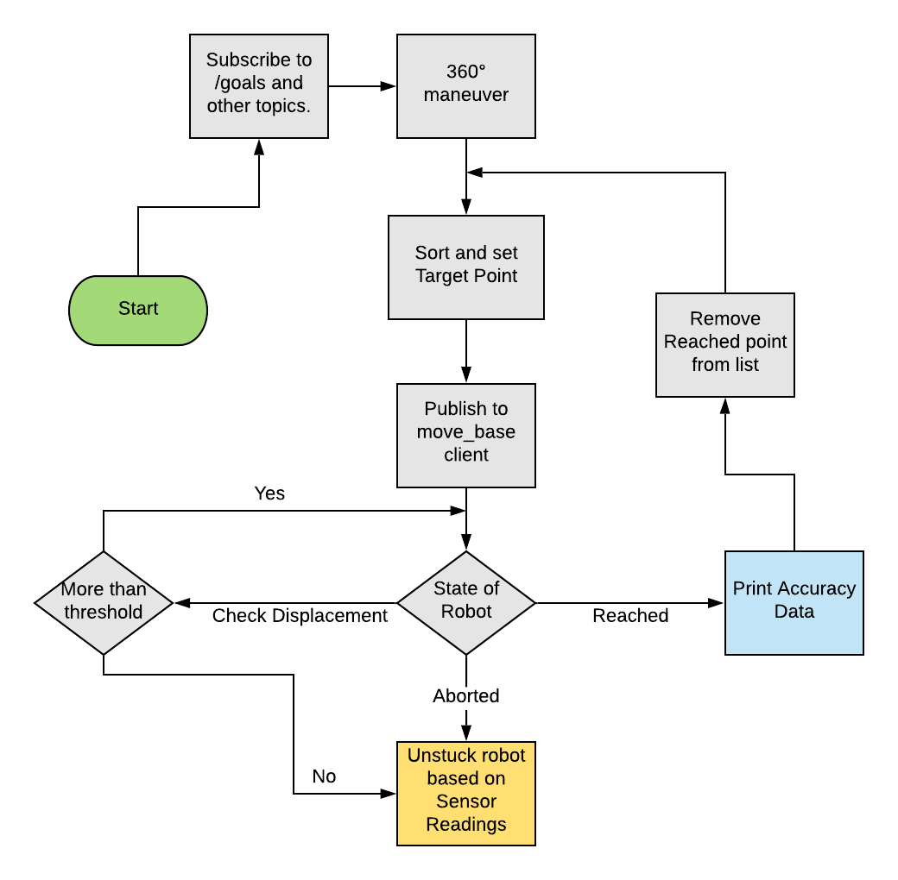

# Title
This repository is part of a Final-project concerned to course of Advanced Software development for Autonomous Robots. It contains rospackages and other file for the problem decribed further. When package is launched, the robot will navigate to as many different goal positions as possible that are published on a topic called /goals. The robot uses move_ base navigation stack to reach the goal. Details of working of move_ base navigation stack can be found at ROSWiki.


# Getting Started
The rospackages can be launched using following commands through terminal. (Although, you should probably be logged into a Linux system with ROS and Python installed). First of all we need to clone a git repository owned by IKI, Hochschule Ravensburg Weingarten. This has a gazebo environment with 4 robot. 

To clone the use below SSH link

```
    git@fbe-gitlab.hs-weingarten.de:mat-iki/amr-multi-turtlebot.git
```

It contains a launchfile called main.launch which will launch the practice arena with four turtlebots in it. You will have to set the arguments model_ file and map_ file e.g:
The said map and model can be found at sa/192128/tier4/final_ project_ practice (File names: map2.yaml and model2.sdf)

```
    roslaunch multi_turtlebot main.launch model_file:=/abolute_path/to/arena.sdf map_file:=/path/to/map2.yaml
```

To run the robot use the following command:
```
    roslaunch prj_walle start.launch robot_id:=1
```
Since all robots will register at the same `ros_master` and `goal_publisher` we are using a concept called `namespaces` to avoid conflicts among the robots. Each robot will have a personal set of topics where it is subscribed to. E.g. `/robot_1/cmd_vel` instead of
`/cmd_vel`. Note that all topics automatically remain the same as the ones you are used to already. The namespace part will be added in front of the
current topic name. When the bot is unable to reach a goal position, it skips this target and moves towards next one.
This repository also contains the goal publisher package that provides input targets. Target point can be modified in "config_final.yaml" file.


# General Descrition of the project
Problem Statement: The robot is placed in an environment with many obtacles (such as tables, chairs, cupboards etc). The target points are defined and robot has to cover all targets (one by one). It should plan the path with 'move_base' node to drive the robot and print whenever it has reached set target.

Following topics, services, actions have been employed (desciption of each is attached):

1. /scan : To subscribe and give output of Laser data
2. /amcl_pose: For current position of  using Monte Carlo Localization method.
3. /goal_publisher: For publishing target points.
4. /cmd_vel: To publish velocity to robot
5. /move_base: To plan the global and local path. It also sends the velocity values to /cmd _vel 


## Node dependencies



# Abstract description and Implementation of the algorithm
The system initiates a node `(/prj_walle_src)`. It subscribes to goal publisher that gives a message of type PointArray. It callbacks to a function that stores all this points inside a list (this command is excecuted only once). Then next step is to chose a target. As of now it is doesn't sort but naively drives to the points in order. Inside a while loop (which runs unil rospy is not shutdown), all topic as mentioned above.
Special attention is given to `move_base` which acts a action server to which goals can be published. Initially the robot is localized but the particle cloud is not converged. In this case if a given goal point is very close then particle cloud may not have enough feedback to converge properly. To take care of this when the robot is spawned we rotate it full 360 degree.

Now let us drive to the points. As first thing we get a target point from our specified sorting function. Next is to send the goal point to the move_base client through command 

```
    <client_name>.send_goal(t)
```

Now comes the tricky part. The algorithm now consists of a always-true loop which has following 3 behaviour states:

1. If goal is point is reached: We can check this by listening to the /result topic of move_base client. If this happens, just inform that robot has reached, print the positional accuracy. Pausing for 1 sec is required as per project rules. Calculate the Cumulative Reward Point and publish.

2. There may be a case that `move_base` isn't able to do the job and it forfeits the goal. In that case /result topic is set at value 4. This goal should be appended to a new list `later_goals`. Cancel the goal from the move_ base client.  

3. There is a third case where the robot is trying continuosly to find a path or is stuck because any further movememnt by DWA Planner will result in collision. In this case the goal should be forfeited and saved in `later_goals`. This is achieved by a time variable that works as follows. It starts the count at zero and stores the position of the robot. Then it increment the time variable by very small value (ie 0.02). As soon as the time reaches 10, then it again check the position of the robot and calculate the displacement wrt to earlier stored  position. If the diplacement is less than a threshold value then it is inferenced that robot is practically stuck and needs to try some other target. 
In case this happens then save the goal for later as explained in point (2).

4. There may be cases that robot is unable to reach a goal because there was another robot there. But potentially it is capable of reaching there, so it should retry. A loop to append `later_goals` to the `all_targets` is defined with retry count limit of 4.

## Process Flow Chart

